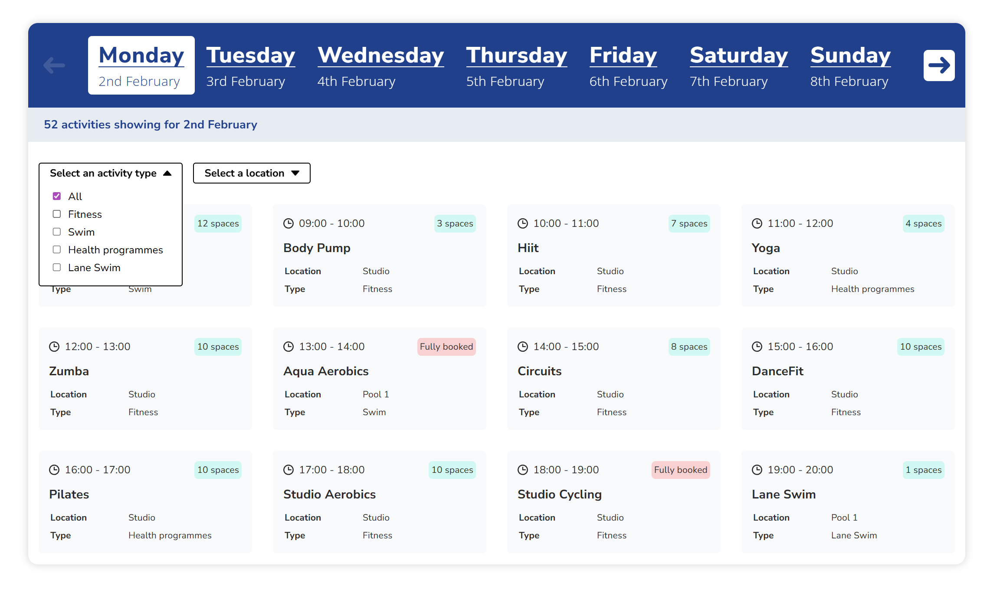
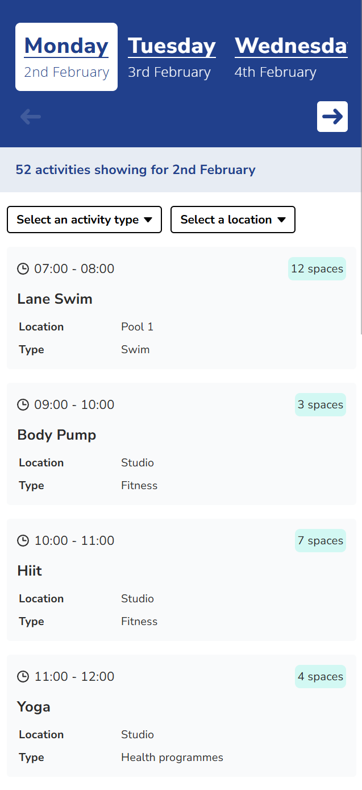

# Willis Dyson – LCC Booking System

## **See the app hosted live here:** https://willis-dyson-lcc-activities.netlify.app/

---

## Final result screenshots

### Desktop view

### Mobile view

---

## Tech Stack

- React 19  
- TypeScript 6  
- Vite 8  
- React Router 7  
- Swiper 12  
- Sass  
- ESLint (React + TypeScript plugins)  
- Node.js 22.17.1  

---

## Dependencies

### Runtime

- react: ^19.2.6  
- react-dom: ^19.2.6  
- react-router-dom: ^7.17.0  
- swiper: ^12.2.0  

### Dev Dependencies

- vite: ^8.0.12  
- typescript: ~6.0.2  
- eslint: ^10.3.0  
- sass: ^1.100.0  
- @vitejs/plugin-react: ^6.0.1  
- @types/react / @types/react-dom  
- eslint plugins for React & TypeScript  

---

## Local Setup

### Requirements

- Node.js v22.17.1+  
- npm v11.4.2+  

### Installation

1. Clone the repository  
   `git clone https://github.com/WillisDyson/lcc-booking-system.git`

2. Install dependencies  
   `npm install`  

3. Navigate to app folder  
   `cd lcc-booking-system-app`  

4. Start development server  
   `npm run dev`  

5. Open in browser  
   `http://localhost:5173`  

---

## Features

### Performance & Structure

- Reusable component architecture  
- Modular Sass with BEM naming conventions  
- Alphabetised CSS for maintainability  
- Design tokens and themes via `:root`  
- Context API for global state management where required  
- Locally stored font assets  

### Usability

- Fully responsive design (mobile-first behaviour)  
- SwiperJS carousel for smooth interaction and good out-of-the-box customisability + accessibility
- SVG icons for scalability and performance 
- Animations and transitions for improved usability and general feel

### Accessibility

- Fully keyboard accessible interface  
- Semantic HTML structure  
- ARIA attributes for screen readers  
- Proper focus states across all interactive elements  
- `rem` based typography for scalability  
- Fully usable at 200% zoom  

### Robustness

- Strong TypeScript type safety  
- Defensive rendering and error handling  
- Clean separation of concerns  

---

## Known Limitations (things that I would add if I had more time):

- “Skip to content” accessibility link  
- Improved animation transitions when filtering tiles  
- “Clear filters” button for better UX  
- Dark mode using `:root` theme tokens  
- Reduced prop drilling via improved state architecture
- Better performance by removing over-reliance on useMemo in some places
- Add unit tests

---

## Project Structure

src/  
├── components/  
├── pages/  
├── context/  
├── styles/  
├── assets/  

---

## Note

Please contact via the links on profile if you have any questions or issues accessing this project. Thank you.
